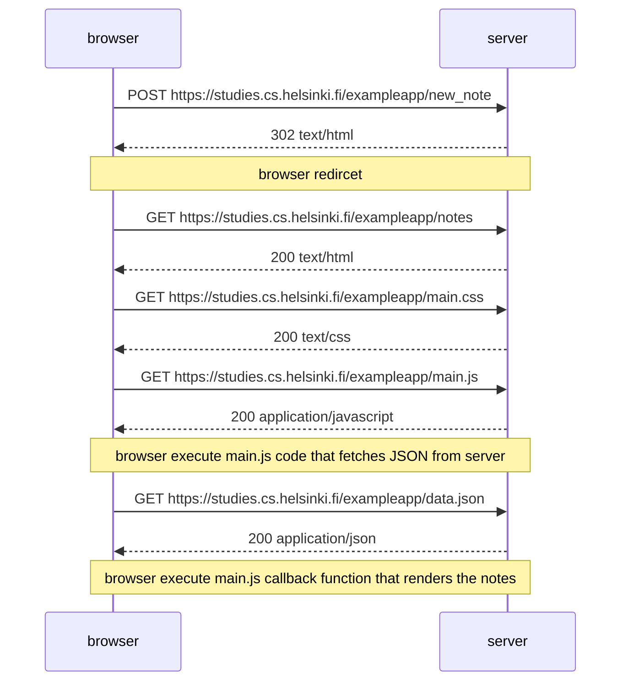
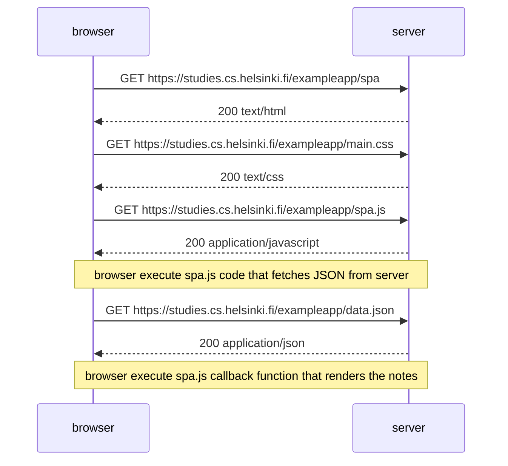
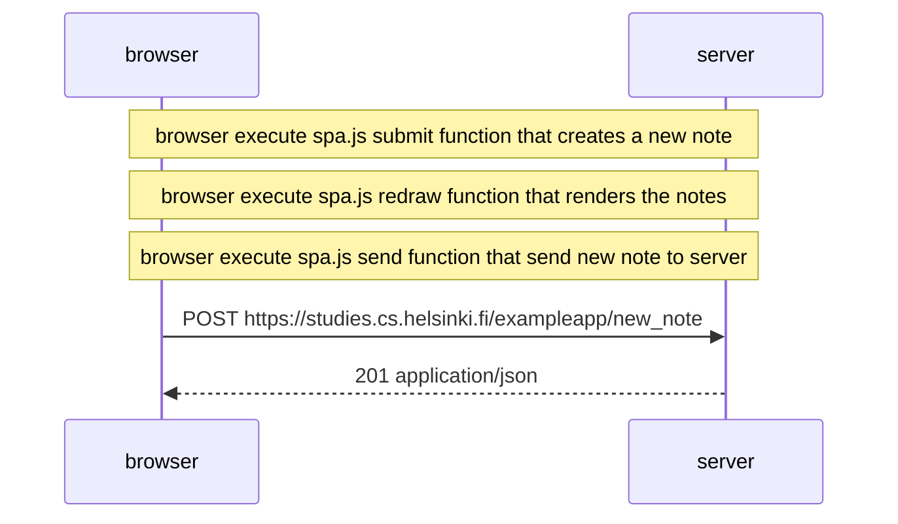

# 0.4

创建一个图表，描述用户创建一个新笔记的情况。
网址为 https://studies.cs.helsinki.fi/exampleapp/notes

# 0.5

创建一个图表，描述用户进入单页应用版本的笔记应用的情况。
网址为 https://studies.cs.helsinki.fi/exampleapp/spa

# 0.6

创建一个图表，描述用户使用单页版应用创建新笔记的情况。
网址为 https://studies.cs.helsinki.fi/exampleapp/spa

