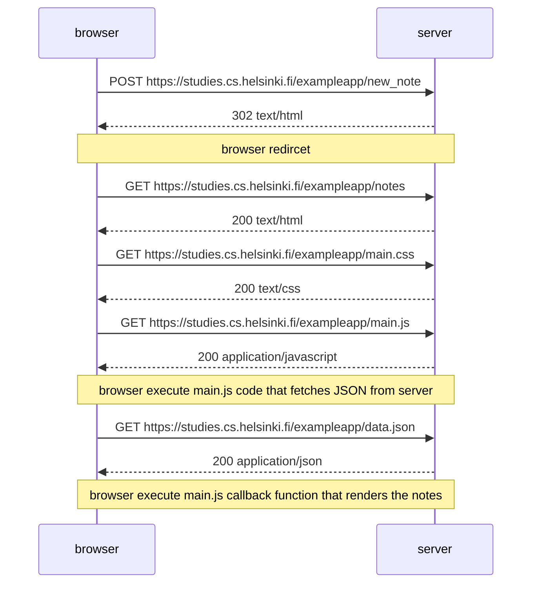
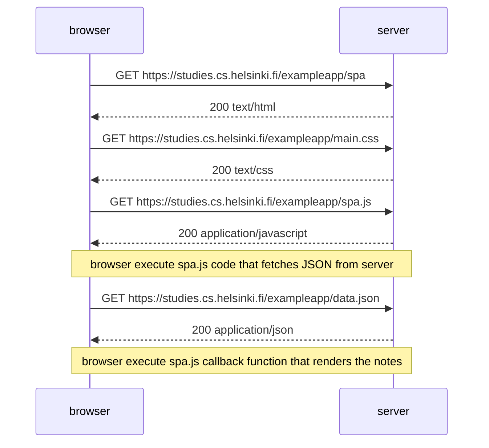
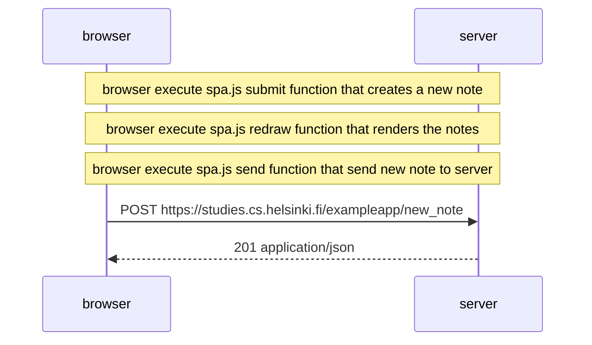

# part1

[题目链接](https://fullstackopen.com/zh/part0/web_%E5%BA%94%E7%94%A8%E7%9A%84%E5%9F%BA%E7%A1%80%E8%AE%BE%E6%96%BD#%E7%BB%83%E4%B9%A0-0-1-0-6)  
图表使用[Mermaid](https://mermaid.js.org/)创建

## 0.4

创建一个图表，描述当用户把东西写进文本字段并点击submit按钮，随后创建了一个新笔记的情况。
网址为 https://studies.cs.helsinki.fi/exampleapp/notes

## 0.5

创建一个图表，描述用户进入单页应用版本的笔记应用的情况。
网址为 https://studies.cs.helsinki.fi/exampleapp/spa

## 0.6

创建一个图表，描述用户使用单页版应用创建新笔记的情况。
网址为 https://studies.cs.helsinki.fi/exampleapp/spa

